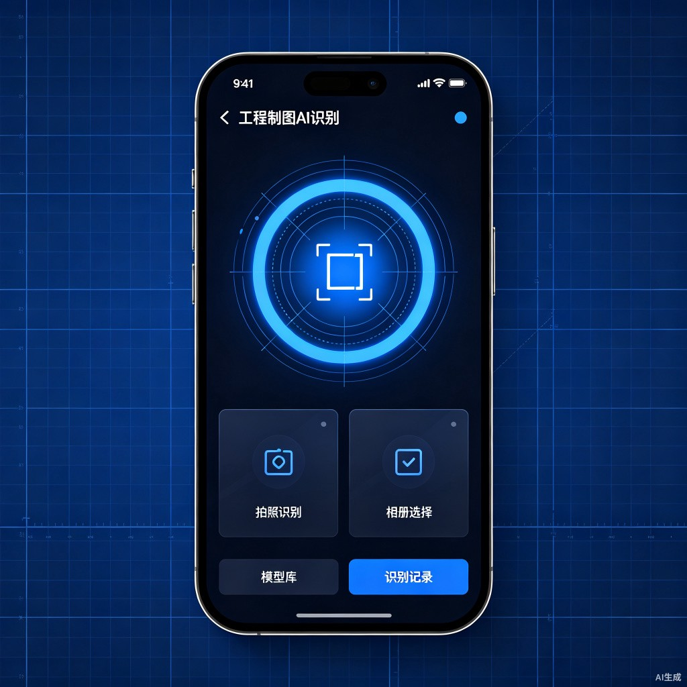
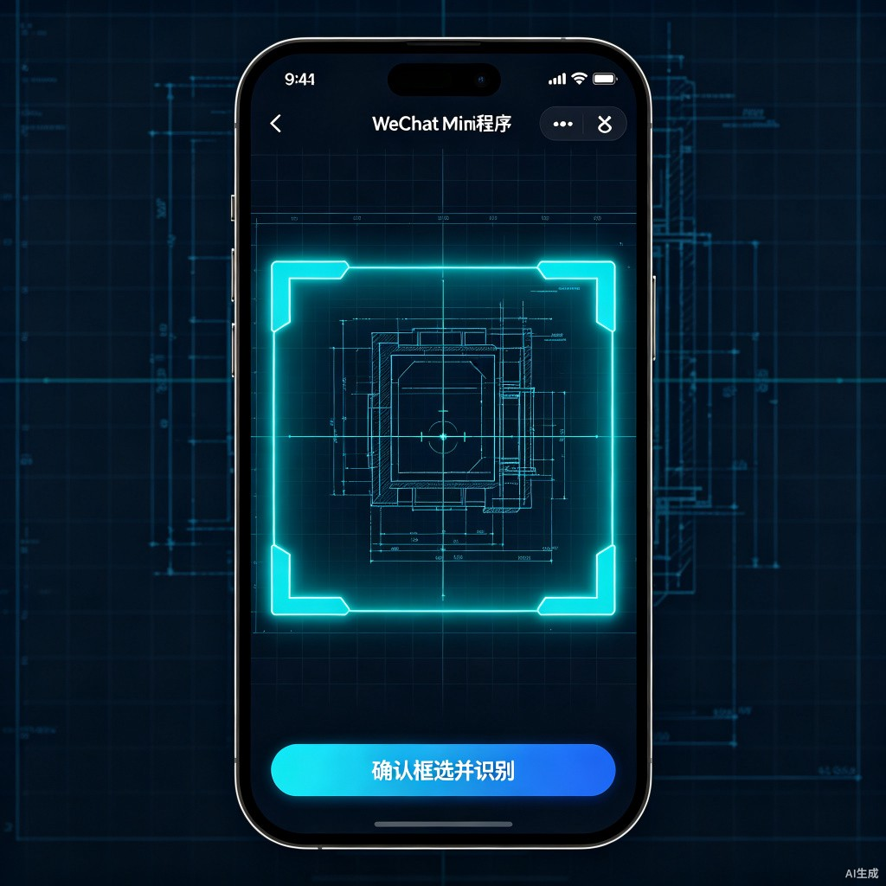
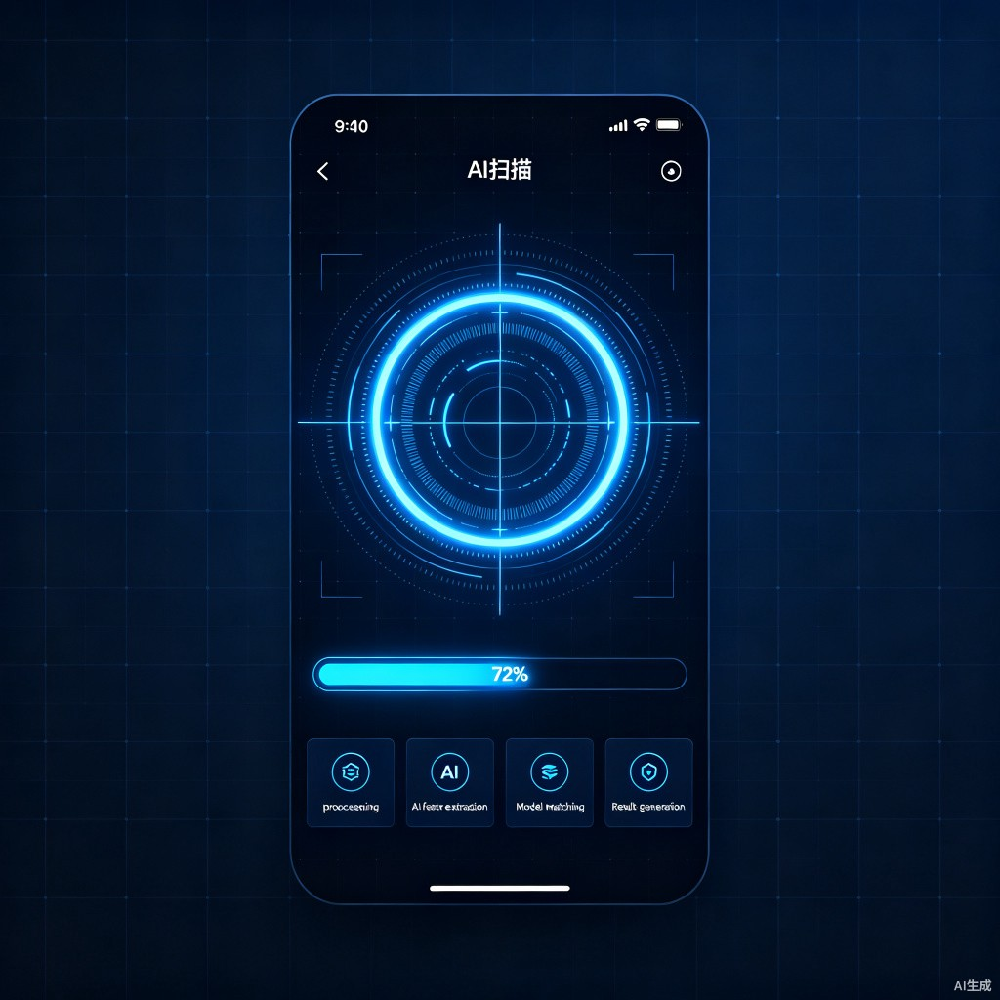
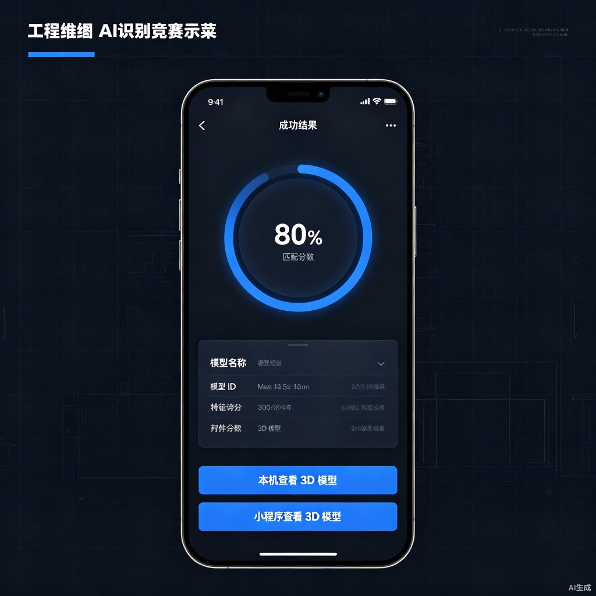
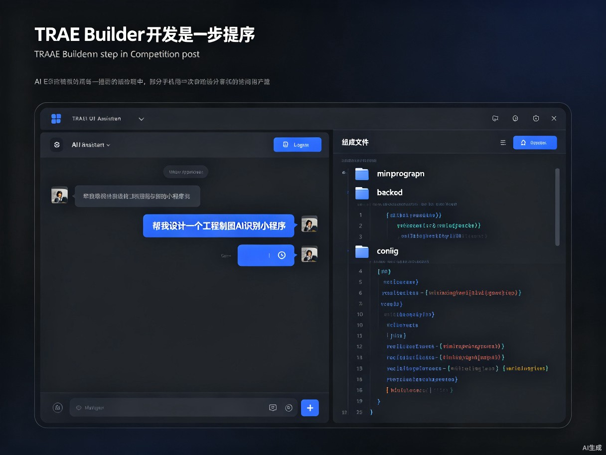
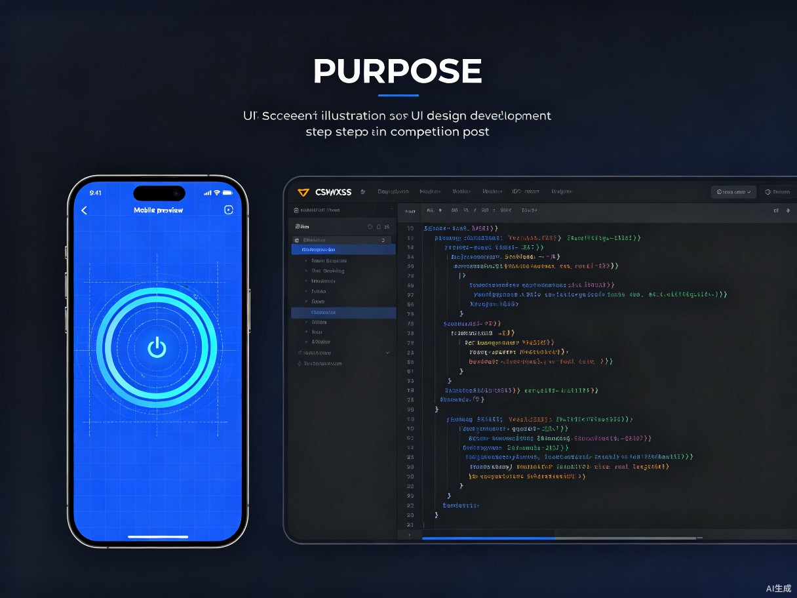
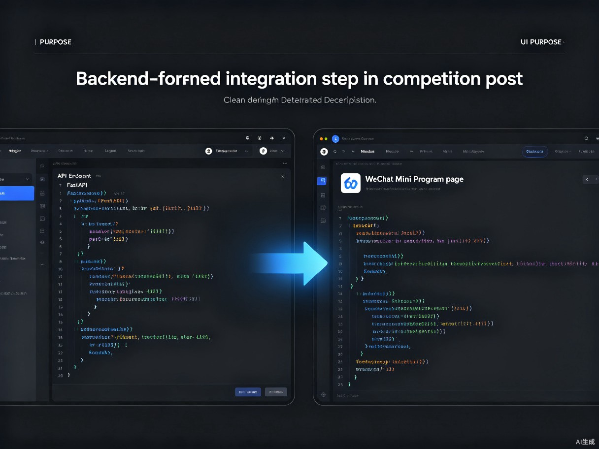

# TRAE AI 创造力大赛 · 初赛发布文案（完整版）

直接复制以下内容到 TRAE 官方中文社区【大赛初赛专区】发布 Demo 帖。

---

## 帖子标题

**【学习工作赛道】工程制图 AI 辅助识别系统 | 拍图纸，秒看 3D 模型**

---

## 帖子正文

### 🏷️ 话题标签

`学习工作` `TRAE创造力大赛` `微信小程序` `AI识别` `工程制图`

> 参加附加赛题可额外加选：`社会公益`

---

## 0. 先和大家打个招呼吧 👋

**我是谁**：我是一名后端开发工程师，平时喜欢研究 AI 应用落地，也接触过微信小程序开发。

**我是怎么用 TRAE 把 Demo 做出来的**：

这个项目从最初的 idea 到可运行的小程序，几乎全程是和 TRAE 一起完成的。我先把自己的需求用大白话讲给它：「我想做一个微信小程序，用户拍一张工程图纸，AI 就能识别出这是哪个零件，然后显示 3D 模型」。TRAE 先帮我梳理了整个技术架构，接着用 Builder 模式一次性生成了后端 API、识别管线和前端页面骨架。

最让我觉得「原来这么简单」的瞬间，是让 TRAE 重新设计 UI 的时候。我只是说「帮我设计一套深色蓝图科技风，要有创意」，它就给出了 5 个新页面（首页、裁剪、扫描、结果、模型库），而且和后端接口完全对得上。放在以前，光是调样式和接口对接就要花好几天。

它帮我跨过的最大一个坎，是前后端局域网真机调试。我不太确定手机和电脑怎么通信、BASE_URL 该怎么配，TRAE 直接在启动脚本里写好了自动探测 LAN IP 并同步到小程序配置的逻辑，省了很多排查时间。

---

## 1. Demo 简介

**是什么**：一个微信小程序，用手机拍摄二维工程图，AI 自动识别并匹配对应的三维模型。

**面向谁**：机械、工程类专业学生和制图初学者，帮助他们把课本上的二维图纸和真实三维零件建立直观联系。

**主要功能**：

| 功能 | 说明 |
|---|---|
| 📷 拍照/相册上传 | 支持拍照或从相册选择工程图纸 |
| ✂️ 自由框选图纸 | 可拖动裁剪框，聚焦图纸主体区域 |
| 🧠 AI 自动识别 | 多阶段匹配，输出识别报告 |
| 🧊 3D 模型查看 | 本机渲染或跳转微信小程序查看 3D 模型 |

**界面预览**：

| 首页 · 扫描识别 | 裁剪 · 框选图纸 | AI 分析 · 识别中 | 结果 · 查看 3D |
|:---:|:---:|:---:|:---:|
|  |  |  |  |

---

## 2. Demo 创作思路

**灵感来源**：

在学《机械制图》的时候，经常对着三视图想象不出零件的真实形状。课本上的图是平面的，但大脑需要三维理解，这个转换过程很费时间。有一次我看到学生拿着手机搜题，就在想：能不能让 AI 也「看懂」工程图纸，直接把图纸变成可旋转的 3D 模型？

**想解决的问题**：

降低「二维图纸 → 三维模型」的认知门槛。传统制图学习中，学生需要靠空间想象力完成从平面到立体的转换；而这个工具希望让学生能在 10 秒内把一张图纸变成可旋转、可缩放的 3D 模型，学习效率更高，理解也更直观。

**为什么做这个方向**：

工程制图是很多工科专业的基础课，但学习方式几十年来变化不大。AI 视觉识别已经能看懂图纸结构，这正好能填补传统教学的直观性缺口。相比娱乐类应用，这个方向的学习价值更明确，也更容易验证效果。

---

## 3. Demo 体验地址

本作品为微信小程序 + FastAPI 后端架构，当前提供以下体验方式：

### 方式一：在线展示页（推荐直接点击）

[点击查看 Demo 展示页](computer://d:\developer_work\Demo_project\competition-demo.html)

> 展示页包含完整的产品介绍、使用流程和界面截图，可直接在浏览器打开。

### 方式二：真机体验

1. 克隆项目代码到本地
2. 运行 `start.bat` 启动后端服务
3. 用微信开发者工具打开 `miniprogram` 目录
4. 手机与电脑连接同一 WiFi 后扫码真机调试

---

## 4. TRAE 实践过程

整个项目使用 **TRAE Builder + Code 模式** 完成开发，核心分为三个阶段：

### 步骤 1：用 Builder 搭建项目骨架

我向 TRAE 描述需求后，它帮我完成了：
- FastAPI 后端服务与 `/api/recognize` 识别接口
- 模型清单、特征索引和 fcode 映射脚本
- 微信小程序基础页面结构

### 步骤 2：设计新版深色科技风 UI

通过多轮对话，让 TRAE 重新设计了 5 个核心页面：
- `home-v2`：蓝图网格背景 + 圆形扫描按钮
- `crop-v2`：深色沉浸裁剪 + 霓虹发光边框
- `scan-loading`：AI 扫描动画 + 4 步骤进度
- `result-v2`：环形进度条 + 识别报告
- `model-list-v2`：网格卡片 + 搜索筛选

并且保证所有新页面与现有后端 API 完全兼容。

### 步骤 3：前后端联调与优化

在 Code 模式下，我精修了识别流程、页面跳转、结果传递和缓存逻辑，最终实现了：
- 拍照 → 裁剪 → AI 识别 → 3D 查看的完整闭环
- 局域网环境下手机真机调试
- 裁剪图识别失败时自动用原图兜底

### 关键任务 Session ID

- `6a47b176ed9e4bd50f95a8fe` —— 项目架构梳理与新版 UI 设计
- `6a47b176ed9e4bd50f95a8fe` —— 新版页面开发与前后端接口联调
- `6a47b176ed9e4bd50f95a8fe` —— 参赛材料整理与 Demo 发布准备

> ⚠️ 注意：以上 Session ID 为占位符，请在 TRAE 对话中双击复制真实 Session ID 后替换。

---

## 5. 对应的报名审核通过的帖子链接

> 在此处粘贴你通过审核的报名帖链接

---

## 📱 补充界面大图

（如需在帖子里单独展示大图，可从下方选择）

### 首页 · 扫描识别

### 裁剪 · 框选图纸主体

### AI 识别中

### 识别结果报告

---

## 🎥 演示视频（可选但加分）

建议录制 30–60 秒视频，展示完整流程：

`拍照 → 框选 → AI 识别 → 查看 3D 模型`

可上传到 Bilibili / 抖音 / YouTube 等平台，在帖子里附上公开链接。如果走抖音人气通道，需带话题 `#vibecoding大赏` `#traeai创造力大赛` 并 `@TRAE @抖音科技`。

---

## 💡 踩坑复盘（可选）

1. **微信胶囊按钮遮挡顶部操作**：新版首页顶部栏预留了足够安全区，避免按钮被右上角原生胶囊遮挡。
2. **真机调试需要同一 WiFi 频段**：手机和电脑不仅要连同一个 WiFi，部分路由器 2.4G/5G 分离时还需要在同一频段。
3. **深色模式适配**：新版页面统一使用深色主题，并同步修改了 `app.json` 的 `window` 配置，避免切页面时闪白。

---

**以上，就是我的初赛 Demo 作品。希望能入围复赛，继续把这个工具做得更完善！**
